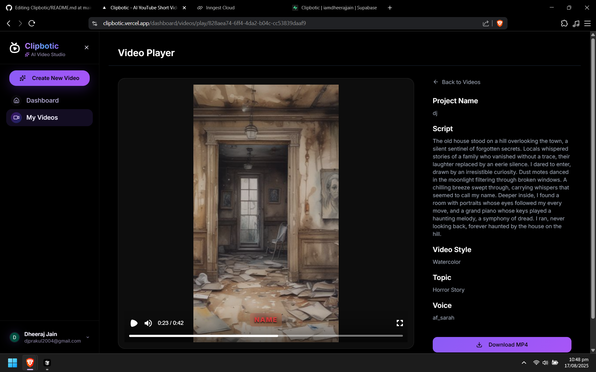
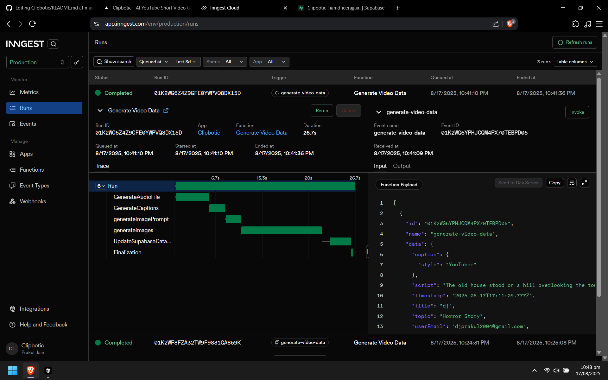
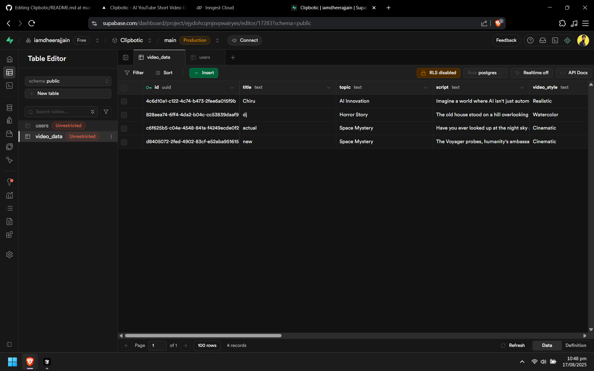

# 🎬 Clipbotic - AI-Powered YouTube Shorts Generator

> **Transform your ideas into stunning YouTube shorts in seconds with AI-powered video generation**

[](https://nextjs.org/)
[](https://reactjs.org/)
[](https://remotion.dev/)
[](https://supabase.com/)
[](https://firebase.google.com/)

---

## ✨ Features

### 🎯 **AI-Powered Content Generation**

- **Smart Script Writing** - Generate engaging scripts from any topic
- **Premium Voiceovers** - Studio-grade voices with natural pacing
- **Cinematic Visuals** - Auto-generated images in multiple art styles
- **Smart Captions** - Auto-timed captions for maximum engagement

### 🎨 **Multiple Video Styles**

- **Realistic** - Photorealistic imagery
- **Cinematic** - Movie-style aesthetics
- **Anime** - Japanese animation style
- **Watercolor** - Artistic watercolor effects
- **Cyberpunk** - Futuristic neon aesthetics
- **GTA** - Gaming-inspired visuals

---

## 🛠️ Tech Stack

### **Frontend**

- **Next.js 15** - React framework with App Router
- **React 19** - Latest React with concurrent features
- **Tailwind CSS** - Utility-first CSS framework
- **Radix UI** - Accessible component primitives

### **Video Generation**

- **Remotion** - Programmatic video creation
- **Google Gemini AI** - Advanced script generation
- **Deepgram** - High-quality text-to-speech
- **AiguruLab** - AI-powered image generation

### **Backend & Database**

- **Supabase** - PostgreSQL database & real-time features
- **Firebase Auth** - Google authentication
- **Inngest** - Background job processing
- **Vercel** - Serverless deployment

---

## 🚀 Quick Start

### Prerequisites

- Node.js 18+
- npm or yarn
- Google Cloud account (for Gemini AI)
- Supabase account
- Firebase account

### 1. Clone & Install

```bash
git clone https://github.com/yourusername/clipbotic.git
cd clipbotic
npm install
```

### 2. Environment Setup

Create a `.env.local` file:

```env
# Google Gemini AI
GEMINI_API_KEY=your_gemini_api_key

# Supabase
NEXT_PUBLIC_SUPABASE_URL=your_supabase_url
NEXT_PUBLIC_SUPABASE_ANON_KEY=your_supabase_anon_key

# Firebase
NEXT_PUBLIC_FIREBASE_API_KEY=your_firebase_api_key
NEXT_PUBLIC_FIREBASE_AUTH_DOMAIN=your_firebase_auth_domain
NEXT_PUBLIC_FIREBASE_PROJECT_ID=your_firebase_project_id
NEXT_PUBLIC_FIREBASE_STORAGE_BUCKET=your_firebase_storage_bucket
NEXT_PUBLIC_FIREBASE_MESSAGING_SENDER_ID=your_firebase_messaging_sender_id
NEXT_PUBLIC_FIREBASE_APP_ID=your_firebase_app_id

# AiguruLab (Image Generation)
AIGURULAB_API_KEY=your_aigurulab_api_key

# Inngest (Background Jobs)
INNGEST_EVENT_KEY=your_inngest_event_key
INNGEST_SIGNING_KEY=your_inngest_signing_key
```

### 3. Database Setup

Run the Supabase schema:

```sql
-- Copy and run the contents of supabase-schema-fixed.sql
-- in your Supabase SQL editor
```

### 4. Start Development

```bash
npm run dev
```

Visit [http://localhost:3000](http://localhost:3000) to see your app!

---

## 🎥 How It Works

### 1. **Describe Your Idea**

Enter a topic or idea - anything from "Space exploration" to "Cooking tutorials"

### 2. **AI Generates Content**

- **Script**: AI writes engaging, concise scripts
- **Voice**: Choose from premium voice options
- **Style**: Pick your visual aesthetic
- **Captions**: Auto-generated with timing

### 3. **Background Processing**

- Images generated via AI
- Audio synthesized from script
- Captions timed to audio
- Video composed with Remotion

---

## 🔧 Development

### Video Development

```bash
# Start Remotion preview
npx remotion preview

# Render a video
npx remotion render src/index.js MyComposition out.mp4
```

---

## 🚀 Deployment

### Vercel (Recommended)

1. Connect your GitHub repository to Vercel
2. Add environment variables in Vercel dashboard
3. Deploy automatically on push to main

### Manual Deployment

```bash
npm run build
npm run dev
npx inngest-cli@latest dev
```



